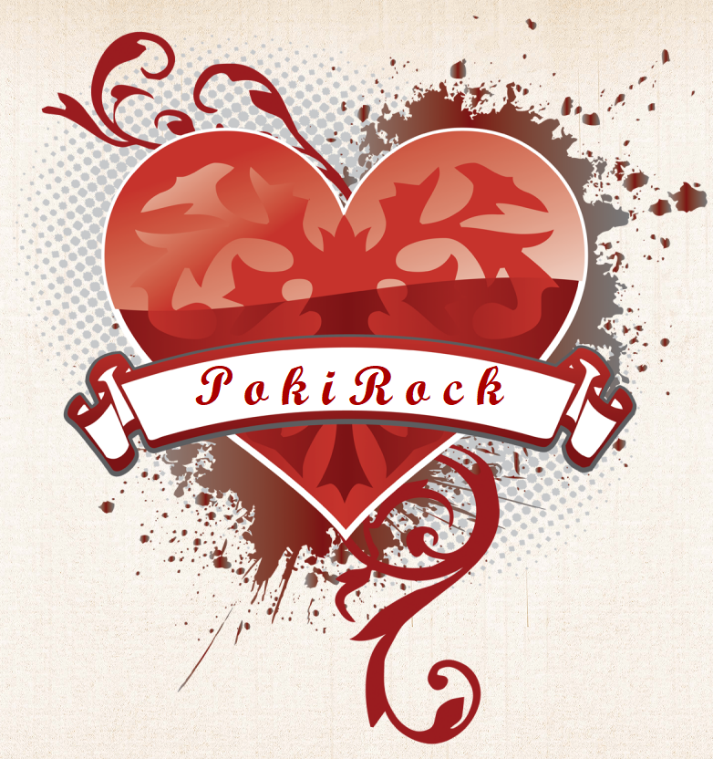

# PokiRock


This is a multiplayer poker application, with uncommon features such a rigged game.

## Technologies

* GUI was implemented using [Qt](https://www.qt.io/)
* [GRPC](https://grpc.io/) + [Boost](https://www.boost.org/) libraries is for Network modules
* Multithreading by using `std::thread`




```
